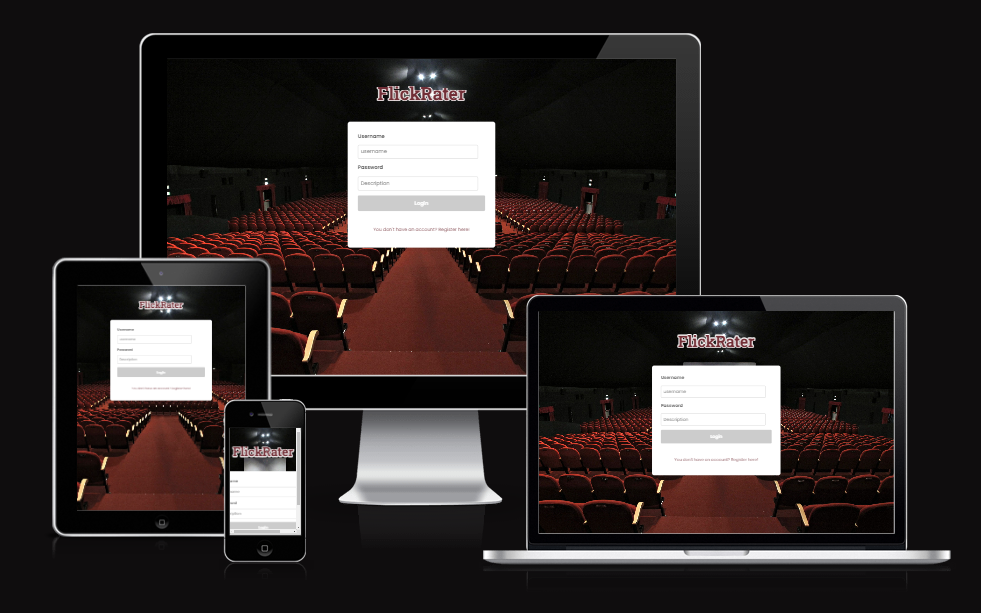
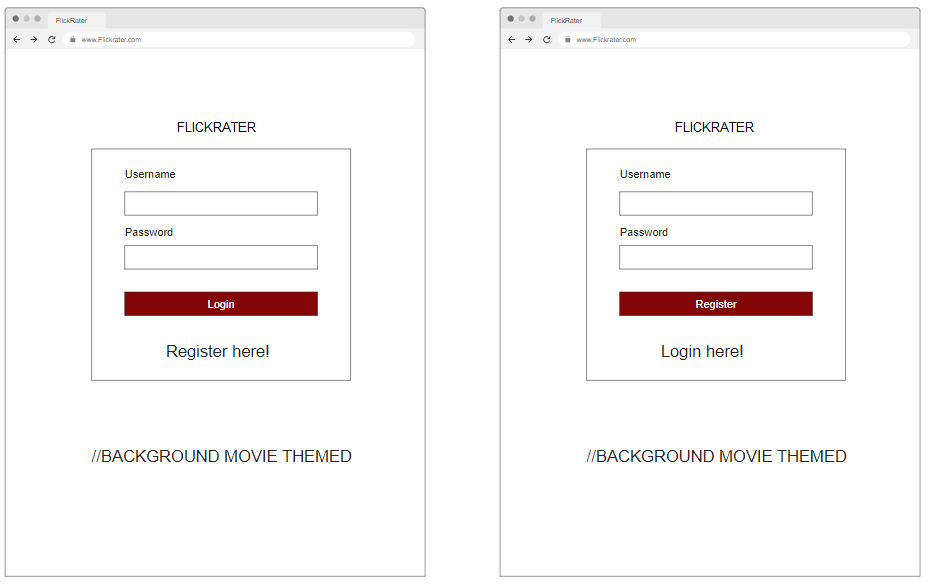
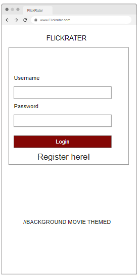
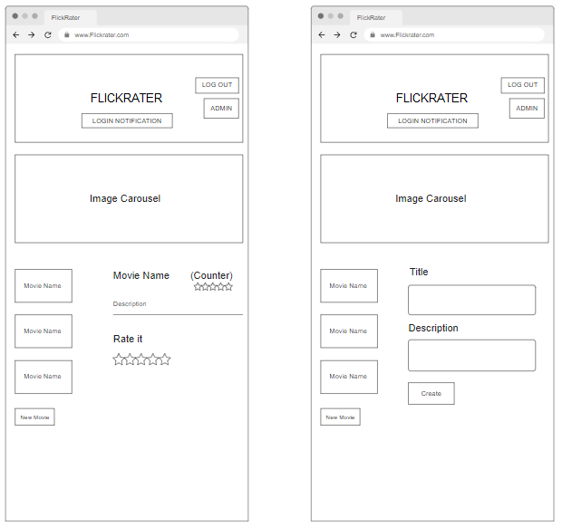
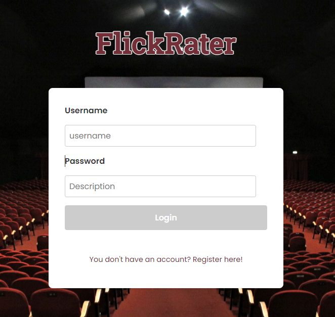
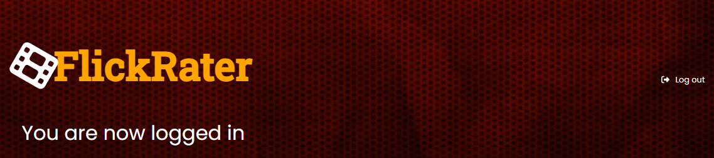

# FlickRater - Project 5

Flickrater is a dedicated movie review platform designed for passionate movie lovers and fans. It offers a comprehensive set of features, allowing users to create an account, log in, and explore a vast collection of movies. Users have the freedom to add their personal movie selections to the platform and also browse and rate films contributed by others.

Each movie listed on Flickrater is accompanied by a concise description, providing users with essential information about the film. Moreover, users can find star ratings assigned by fellow members of the Flickrater community. These ratings serve as valuable insights, reflecting the collective opinion of the site's users.

Flickrater aims to provide an interactive and engaging platform where movie enthusiasts can connect, discover new films, and share their thoughts through ratings.

The website has been deployed to Heroku and can be accessed at the following URL: https://project-5-movierater-fe-80b23e401183.herokuapp.com

# Table of contents

- [FlickRater - Project 5](#flickrater-project-5)
- [Table of contents](#table-of-contents)
- [The Strategy Plane](#the-strategy-plane)
  - [Site Goals](#site-goals)
  - [Agile Planning](#agile-planning)
  - [Epics](#epics)
  - [Set Up](#set-up)
  - [Movie Listing Creation](#movie-listing-creation)
  - [Movie Description](#movie-description)
  - [Movie Rating](#movie-rating)
  - [Profiles](#profiles)
- [User Stories](#user-stories)
- [Reuse of Components](#reuse-of-components)
- [Wireframe](#wireframe)
  - [Wireframe Mobile](#wireframe-mobile)
- [The Structure Plane](#the-structure-plane)
- [The Surface Plane](#the-surface-plane)
- [Technologies](#technologies)
- [Testing](#testing)
  - [User Story Testing](#user-story-testing)
  - [Lighthouse Testing](#lighthouse-testing)
  - [Responsiveness](#responsiveness)
  - [Eslint](#eslint)
  - [Validator Results](#validator-results)
  - [Bugs and their fixes](#bugs-and-their-fixes)
- [Deployment](#deployment)
  - [Heroku Deployment](#heroku-deployment)
  - [Version Control](#version-control)
  - [Run Locally](#run-locally)
- [Credits](#credits)
  - [Content](#content)
- [Frontend Libraries](#frontend-libraries)
  - [Acknowledgements](#acknowledgements)

# The Strategy Plane

## Site Goals

The primary objective of FlickRater, a website designed for movie enthusiasts, is to provide a comprehensive movie listing complete with detailed descriptions and overall ratings. Additionally, it aims to foster an interactive user community by allowing individuals to add their own movie listings to the growing collection.

## Agile Planning

This project was developed following agile principles, with a series of sprints. Each feature was prioritized and labeled as either "must-have," "should-have," or "could-have." We began by implementing the must-have features, followed by the should-have features, and finally addressed the could-have features if time and resources permitted. This approach ensured the delivery of a comprehensive website, with optional enhancements added based on capacity.

The Kanban board, created using GitHub Projects, facilitated project management and can be accessed [here](https://github.com/users/PrezBala/projects/2). For more detailed information on each task, simply click on the respective view.

## Epics

## Set Up

This Epic covers all the initial setup of the React application and dependencies in order to begin coding features.

## Movie Listing Creation

This Epic focuses on developing the front-end aspects of the application related to the creation of movie listings. It enables users to interface with the backend API to create, read, update, and delete their personal movie listings.

## Movie Description

This Epic targets the front-end development pertaining to descriptions of movie listings. It provides an avenue for users to engage with the backend API and add detailed descriptions to the movies listed.

## Movie Rating

This Epic encompasses the front-end development regarding movie ratings. Users are empowered to interact with the backend API to contribute their individual ratings to movies listed and view overall rating statistics. The rating system is modeled on a 5-star scale.

## Profiles

This Epic is centered around the front-end development concerning user profiles. It gives users the ability to engage with the backend API through the user interface. This ensures that users can only modify or delete movie listings they've personally created. It also incorporates a check to verify if the user is a staff member, thereby granting them access to the admin section if applicable.

# User Stories

By Epics

Movie Listings

As an authenticated user, I have the capability to create movie listings, including the addition of a title and description for each movie.

As an authenticated user, I can peruse all available movie listings, scrolling seamlessly down the page without the need to click on "next page".

Movie Ratings

As an authenticated user, I can modify the rating for an existing movie listing.

As an authenticated user, I can visualize the cumulative rating average for a particular movie listing through a 5-star rating system.

As an authenticated user, I can see the total number of users who have contributed a review for a movie.

Profile

As an authenticated user, I am permitted to make changes exclusively to the listings I have personally created, ensuring the integrity of other users' contributions.

As an authenticated administrator, I am the only user type that can gain access to the admin section, which is purposely hidden from non-admin users.

As an authenticated administrator, once in the admin section, I can view all created movie listings and possess the authority to delete them if necessary.

Setup

As a prospective user, I am presented with clear sign-in and registration options, allowing for a streamlined and intuitive access process.

As a user, I require a fully responsive navigation menu for effortless site navigation regardless of the device I am using.

# Reuse of Components

* In the Auth.js component, I have designed a generic login/register form that toggles between login and register view based on the isLoginView state. This logic encapsulates both operations in a single component, enabling me to reuse this component wherever a login or register feature is needed without duplicating code.

* The App.js file includes several examples of reusable components: MovieList, MovieDetails, and MovieForm are used to display various pieces of information about movies. These components are reused to display information about different sets of movies without modifying the components themselves.

* useCookies hook: This custom hook is utilized in multiple places: Auth.js, App.js, and AdminPanel.js. This hook aids in managing cookies throughout the application, which is a crucial aspect of maintaining and checking user sessions. This is a form of logic reusability.

# Wireframe

The wireframe provided below clearly demonstrates where users can register and log in. To immediately immerse visitors in the website's theme, a movie-inspired background will be displayed prominently. For the sake of visual consistency, the chosen color scheme will be maintained across the entire website.

A visually appealing loading screen will be incorporated for times when a page is loading, purely for aesthetic enhancement. In instances of incorrect login credentials, users will be greeted with a prompt advising them of the error and suggesting a page refresh.

Upon successful login, users will be greeted with a notification confirming their logged-in status. They'll also see an image carousel cycling through various movies, designed to spark their interest. The 'Log Out' button, prominently placed in the top banner, is easily accessible. Administrators will also find the 'Admin Section' button within the same banner, although it's only visible to them.

Users will be presented with a curated list of movies. When a movie is selected, they can view the movie's name, the current rating count, and add their own rating through a 5-star system. They also have the option to contribute their own movie listings. This can be achieved by clicking the 'New Movie' button and filling in the 'Title' and 'Description' fields.

Users have the ability to modify or delete their personal movie listings, accomplished via the 'Edit' and 'Delete' buttons located within each individual movie listing they've created. They can update the title and description of the movie, and these changes can be saved by clicking the 'Update' button.

Administrators or staff users have exclusive access to an 'Admin Section' on the webpage, accessible through an 'Admin Section' button that is only visible to these users. Upon entering this section, they can view all the movie listings created and have the ability to delete them directly from the front-end interface, which communicates with the backend API.

## Wireframe Mobile

The images below depict the wireframe for how the FlickRater webpage will be displayed on mobile devices. They demonstrate the commitment to ensuring readability and accessibility, with buttons that remain unobstructed and easily usable. Despite the smaller screen size of mobile devices, users will still be able to effortlessly provide ratings.

# The Structure Plane

## Features

Setup

As a user, I value a website's favicon that allows me to rapidly spot the FlickRater tab amidst numerous others.

Implementation:

We have added a site favicon for FlickRater, featuring a moviereel image. This new feature aids users in swiftly distinguishing the FlickRater tab while navigating through multiple browser tabs.

User Story:

Upon initial visit to the site, I can view the options to log in or register.

Implementation:

I have added checks to recognize whether a user is logged in or out. This ensures users cannot bypass the UI and access restricted pages.

Additionally, i have implemented redirects on URLs to prohibit standard users from gaining access to admin pages.

Presented below is the login interface:

Following is the registration interface:

User Story:

Upon launching the site, I've incorporated a loading screen.

Implementation:

I've introduced a loading screen that appears during login, logout, and when accessing the admin section, given you have the necessary admin privileges.

User Story:

Upon successful login, the user will be directed to the main page of FlickRater.

Implementation:

I've incorporated a banner at the top featuring the prominent title 'FlickRater', followed by a message confirming the user's successful login. The aim was to maintain a clean and intuitive UI. The logout button is explicitly displayed within the banner, and the admin section is also noticeable but only to those with staff user or administrator rights.

Below is the image of the main banner

I've further integrated an image carousel that rotates through various movies at set intervals. This addition is purely for aesthetic purposes as it significantly enhances the overall visual appeal of the site.

The movie listing is presented as shown below, adhering to the consistent color scheme used throughout the website. The text is clear and prominent. The edit and delete icons are also distinctly visible, and are only accessible to the user who created the specific listing.

Situated at the end of all the movie listings is the "new movie" button. It's clearly visible, and upon clicking, it enables the user to generate a new movie listing.

Upon selecting the "new movie" button, the user will be faced with the following interface. They are expected to fill in both the title and description fields, and then click on the "Create" button to finalize the process.

Upon choosing an existing movie listing, the user will see the display as shown below. The movie's name is clearly identifiable, flanked by a total star rating and the count of ratings this movie has received.

Show the total number of ratings in addition to the average star rating for the specific movie listed below.

Users can modify the rating for each movie by selecting a star rating in the "Rate it" section.

When a user opts to modify an existing movie listing, the right-hand pane refreshes, displaying the title and description fields. The user has the capability to alter the text in these fields.

The user needs to ensure that the text within the fields does not exceed the 32-character limit. If a movie listing is attempted with text beyond this limit, a message will appear in place of the listing to alert the user. This notification will disappear once the user refreshes the screen and attempts to create the listing again within the correct parameters.

've made sure that the edit and delete buttons are only visible to the user who created the specific listing. In the screenshot below, you can see a listing without the buttons - one that I didn't create - and another one with the buttons, which I created.

When an administrator or staff member logs in, they will see an additional text labeled "Admin section". By clicking on this, they will be navigated to the administrative panel.

The image below further demonstrates that the text "Admin section" is not visible to non-staff users.

Inside the admin panel, administrators can view all movie listings and have the power to delete any listing created by users. Any changes made here are also reflected in the backend.

I've incorporated a footer into the site to acknowledge the creator and to indicate that this is for Project 5.

# The Surface Plane

Design

Colour-Scheme

The background colour for individual componenets is black (#000000) with a black wallpaper used.

Movie listing colour used. (#800020)

Main text is white (#ffffff) apart from the FlickRater logo (#FFA500)

# Technologies

* React

This is the primary framework utilized for crafting the user interface.

* Node

This is the package manager employed to install necessary dependencies.

* Eslint

This is the linting tool leveraged to ensure coding practices are up to standard.

* Heroku

This platform is used to host the application.

* Git

This is the version control software utilized for managing code changes.

* Github

This is the repository where the base code and documentation are stored.

# Testing

## User Story Testing

__Movie Listing__

__New Movie__

__Edit and Delete Description / Title__

__Admin Section__

__Authorisation__

## Lighthouse Testing

Lighthouse testing was successfully carried out, and the results were satisfactory. Potential areas of improvement were identified, such as image compression prior to uploading, which could enhance the score. However, due to time constraints, this functionality was not implemented in the current iteration but may be considered for future enhancements.

## Responsiveness

Each page was tested to guarantee a responsive design across various screen sizes, starting from 320px and upwards.

Here's the testing procedure:

* Launch the browser and navigate to FlickRater.
* Activate the developer tools (Right-click, then select Inspect).
* Switch to responsive mode and decrease the width to 320px.
* Adjust the zoom level to 50%.
* Expand the responsive window to its maximum width by clicking and dragging.

The anticipated outcome:

The website should exhibit responsiveness across all screen sizes without pixelation or distortion of images. There should be no horizontal scrolling, and no elements should overlap.

Outcome:

The website performed as expected, maintaining its responsive nature.

Additionally, the website was examined on a variety of devices and demonstrated no issues related to responsive design.

## Eslint

Eslint was successfully set up and configured for local usage. Upon execution, a single warning emerged regarding an unspecified React version, but no errors were reported.

## Validator Results

Each CSS file was systematically validated to ensure its integrity. During the validation process, a single error was detected, specifically an unknown declaration, which was promptly rectified.

## Bugs and their fixes

The issue with the rating counter not updating correctly unless the page was manually refreshed was resolved by including the updatedMovie(movie) function call within the loadMovie function in App.js.

A bug was identified where a standard user was able to view the admin section button. To rectify this, a check for isStaff === true was implemented in App.js.

When a user selected to log out the message "Wrong credentials, please refresh and try again" message appeared, an if statement was added in App.js to handle the "Logging out..." message instead.

Additionally, an error was fixed where the link was not defined upon the first login. This was resolved by including the import statement import { Route, Routes } from 'react-router-dom'; within App.js.

# Deployment

## Heroku Deployment

* I first navigated to Heroku and created an account.
* Then, I clicked on the 'New' button, located at the top right corner.
* From the drop-down options, I chose 'Create new app'.
* I entered a unique name for my app.
* I selected the desired region, and then clicked on 'Create app'.
* I clicked on the 'Resources' tab and searched for 'Heroku Postgres'.
* I navigated to the 'Deploy' tab.
* I scrolled down to 'Connect to GitHub', signed in, and authorized when prompted.
* I searched for the repository I wanted to deploy in the search box and clicked 'Connect'.
* I scrolled down to 'Manual deploy', selected the 'main' branch, and then clicked 'Deploy'.

## Version Control

The site was developed using the Codeanywhere editor and pushed to the remote repository named 'Project5API' on GitHub.

Throughout the development process, the following Git commands were used to push code to the remote repository:

git commit -m "commit message": After adding the necessary files to the staging area, this command was used to commit the changes to the local repository with a descriptive commit message.

git push: Finally, this command was used to push all the committed code from the local repository to the remote repository on GitHub.

By utilizing these Git commands, the code changes made during development were properly staged, committed, and pushed to the remote repository, ensuring that the latest version of the code was available on the GitHub repository 'Project5API'.

## Run Locally

To clone the GitHub repository I want to use locally, I followed these steps:

* I went to the GitHub repository and clicked on the "Code" dropdown button.

* From the options, I selected "HTTPS".

* I copied the repository link to my clipboard.

* Opening my preferred IDE (with Git installed), I used the IDE terminal.

* I typed git clone followed by the copied repository URL into the terminal.

* Pressing Enter, the project was cloned on my local machine.

* Next, I needed to install the project's dependencies. Here's how I did it:

* I opened the cloned project in my IDE.

* In the IDE terminal, I ran npm install command.

* This command installed all the necessary dependencies for the project.

* Finally, to run the application, I followed these steps:

* After the dependencies were installed, I ran npm start in the IDE terminal.

* This started the application.

* I accessed the application through the specified development server or the provided local URL.

By following these steps, I successfully cloned the GitHub repository, installed its dependencies, and ran the application locally on my machine.

# Credits

This article was instrumental in helping me implement the straightforward star rating component.

* https://github.com/awran5/react-simple-star-rating

## Content

Images i found on google image search for image roulette.

# Frontend Libraries

I've utilized various frontend libraries to enhance the functionality and user experience of my React application. 

Font Awesome icons play a significant role in visually enriching the design, and I've integrated them using "@fortawesome/fontawesome-svg-core" and "@fortawesome/react-fontawesome."

To handle HTTP requests from the browser, I've incorporated "axios," a widely-used library known for its simplicity and effectiveness in handling API calls.

For proper React prop validation, I've opted for "prop-types," which helps ensure the correctness and consistency of data passed between components.

The core building block of my project is "react." With this library, I've created dynamic and interactive user interfaces that offer a smooth and engaging experience.

To manage cookies efficiently in my application, I've integrated "react-cookie," simplifying the process of working with browser cookies.

To work with the DOM and render React components, I've employed "react-dom," an essential package that allows seamless integration between React and the browser's DOM.

For optimizing the management of the document's head and handling metadata in my React app, "react-helmet" has proven to be an indispensable tool.

To create visually appealing and responsive carousels, I've made use of "react-responsive-carousel," which facilitates the creation of dynamic and mobile-friendly image sliders.

For handling routing within my application, I've turned to "react-router-dom." This powerful library enables smooth navigation and handling of different views in my React app.

The "react-scripts" package provides the necessary configuration and scripts required by Create React App, making the development process much more streamlined.

Lastly, I've implemented "web-vitals" to measure key performance metrics of my web application, ensuring it runs efficiently and delivers an optimal user experience.

In summary, the combination of these frontend libraries has allowed me to build a feature-rich and well-tested React application that offers a seamless user experience.

## Acknowledgements

I want to thank:

* The Slack community. The help a student is able to receive from the other students is a really great tool to have.

* My wife for testing my site for me.

* Youtube - This platform has been incredibly useful and after watching countless videos i've learnt several different ways to code certain things i wouldnt have thought of before.

* I'm grateful to the student support team for their exceptional assistance in resolving the deployment issue I experienced with migrating from GitPod to Codeanywhere.

[Back to Table of Contents](https://github.com/PrezBala/Project5fe#table-of-contents)
