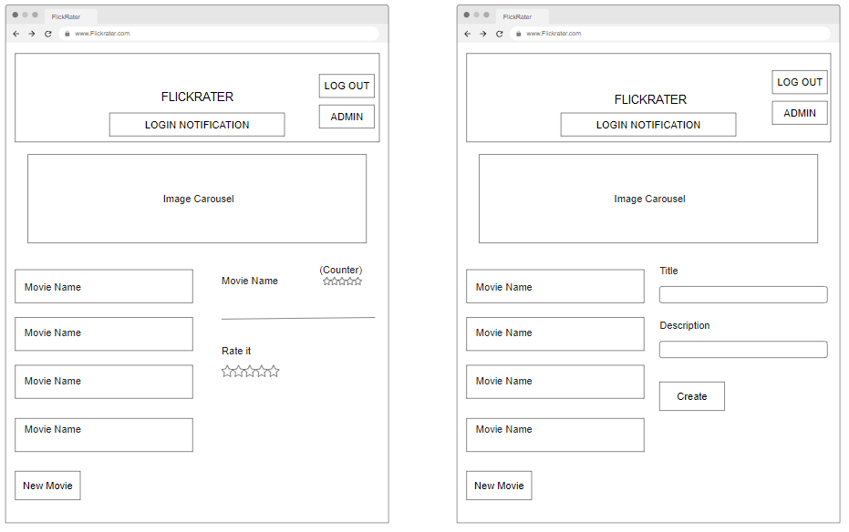

# FlickRater - Project 5

Flickrater is a dedicated movie review platform designed for passionate movie lovers and fans. It offers a comprehensive set of features, allowing users to create an account, log in, and explore a vast collection of movies. Users have the freedom to add their personal movie selections to the platform and also browse and rate films contributed by others.

Each movie listed on Flickrater is accompanied by a concise description, providing users with essential information about the film. Moreover, users can find star ratings assigned by fellow members of the Flickrater community. These ratings serve as valuable insights, reflecting the collective opinion of the site's users.

Flickrater aims to provide an interactive and engaging platform where movie enthusiasts can connect, discover new films, and share their thoughts through ratings.

# Table of contents

- [FlickRater API- Project 5](#flickrater-api--project-5)
- [Table of contents](#table-of-contents)
- [Development Goals](#development-goals)
- [Agile Planning](#agile-planning)
  - [Epics](#epics)
  - [Set Up](#set-up)
  - [Movie Creation](#movie-creation)
  - [Movie Description](#movie-description)
  - [Custom Auth Token](#custom-auth-token)
  - [Movie Rating](#movie-rating)
- [User Stories](#user-stories)
- [API Endpoints](#api-endpoints)
- [Security](#security)
- [Technologies](#technologies)
  - [Python Packages](#python-packages)
- [Testing](#testing)
  - [Validator Results](#validator-results)
- [Deployment](#deployment)
  - [Version Control](#version-control)
- [Heroku Deployment](#heroku-deployment)
  - [Run Locally](#run-locally)
- [Credit](#credit)

# The Strategy Plane

## Site Goals

The primary objective of FlickRater, a website designed for movie enthusiasts, is to provide a comprehensive movie listing complete with detailed descriptions and overall ratings. Additionally, it aims to foster an interactive user community by allowing individuals to add their own movie listings to the growing collection.

## Agile Planning

This project was developed following agile principles, with a series of sprints. Each feature was prioritized and labeled as either "must-have," "should-have," or "could-have." We began by implementing the must-have features, followed by the should-have features, and finally addressed the could-have features if time and resources permitted. This approach ensured the delivery of a comprehensive website, with optional enhancements added based on capacity.

The Kanban board, created using GitHub Projects, facilitated project management and can be accessed [here](https://github.com/users/PrezBala/projects/1/views/1). For more detailed information on each task, simply click on the respective view.

## Epics

## Set Up

This Epic covers all the initial setup of the React application and dependencies in order to begin coding features.

## Movie Listing Creation

This Epic focuses on developing the front-end aspects of the application related to the creation of movie listings. It enables users to interface with the backend API to create, read, update, and delete their personal movie listings.

## Movie Description

This Epic targets the front-end development pertaining to descriptions of movie listings. It provides an avenue for users to engage with the backend API and add detailed descriptions to the movies listed.

## Movie Rating

This Epic encompasses the front-end development regarding movie ratings. Users are empowered to interact with the backend API to contribute their individual ratings to movies listed and view overall rating statistics. The rating system is modeled on a 5-star scale.

## Profiles

This Epic is centered around the front-end development concerning user profiles. It gives users the ability to engage with the backend API through the user interface. This ensures that users can only modify or delete movie listings they've personally created. It also incorporates a check to verify if the user is a staff member, thereby granting them access to the admin section if applicable.

# User Stories

By Epics

Movie Listings

As an authenticated user, I have the capability to create movie listings, including the addition of a title and description for each movie.

As an authenticated user, I can peruse all available movie listings, scrolling seamlessly down the page without the need to click on "next page".

Movie Ratings

As an authenticated user, I can modify the rating for an existing movie listing.

As an authenticated user, I can visualize the cumulative rating average for a particular movie listing through a 5-star rating system.

As an authenticated user, I can see the total number of users who have contributed a review for a movie.

Profile

As an authenticated user, I am permitted to make changes exclusively to the listings I have personally created, ensuring the integrity of other users' contributions.

As an authenticated administrator, I am the only user type that can gain access to the admin section, which is purposely hidden from non-admin users.

As an authenticated administrator, once in the admin section, I can view all created movie listings and possess the authority to delete them if necessary.

Setup

As a prospective user, I am presented with clear sign-in and registration options, allowing for a streamlined and intuitive access process.

As a user, I require a fully responsive navigation menu for effortless site navigation regardless of the device I am using.

# Wireframe

The wireframe provided below clearly demonstrates where users can register and log in. To immediately immerse visitors in the website's theme, a movie-inspired background will be displayed prominently. For the sake of visual consistency, the chosen color scheme will be maintained across the entire website.

A visually appealing loading screen will be incorporated for times when a page is loading, purely for aesthetic enhancement. In instances of incorrect login credentials, users will be greeted with a prompt advising them of the error and suggesting a page refresh.

Upon successful login, users will be greeted with a notification confirming their logged-in status. They'll also see an image carousel cycling through various movies, designed to spark their interest. The 'Log Out' button, prominently placed in the top banner, is easily accessible. Administrators will also find the 'Admin Section' button within the same banner, although it's only visible to them.

Users will be presented with a curated list of movies. When a movie is selected, they can view the movie's name, the current rating count, and add their own rating through a 5-star system. They also have the option to contribute their own movie listings. This can be achieved by clicking the 'New Movie' button and filling in the 'Title' and 'Description' fields.

Users have the ability to modify or delete their personal movie listings, accomplished via the 'Edit' and 'Delete' buttons located within each individual movie listing they've created. They can update the title and description of the movie, and these changes can be saved by clicking the 'Update' button.

Administrators or staff users have exclusive access to an 'Admin Section' on the webpage, accessible through an 'Admin Section' button that is only visible to these users. Upon entering this section, they can view all the movie listings created and have the ability to delete them directly from the front-end interface, which communicates with the backend API.

# Technologies

- Django
This is the primary framework utilized for the creation of the application.

- Django REST Framework
This framework is employed for the development of the API.

- Heroku
This platform is used for the hosting of the application.

- Git
This tool is utilized for version control.

- Github
This is the repository used for the storage of the code base and documentation.

## Python Packages

asgiref==3.6.0
I use this for ASGI support, which helps me with asynchronous web applications.

cloudinary==1.33.0
I use this service to manage images in the cloud, simplifying media management.

dj-database-url==2.0.0
This tool allows me to utilize database URLs in my Django configuration for flexible deployment.

dj-static==0.0.6
This is a static file server for Django, useful during app development and deployment.

Django==3.2.13
The main high-level web framework I use for rapid and clean application development.

django-cloudinary-storage==0.3.0
This helps me use Django storages with Cloudinary.

django-cors-headers==4.0.0
I use this Django app to add Cross-Origin Resource Sharing (CORS) headers to responses.

django-rest-authtoken==2.1.4
A simple token-based authentication system I use for my Django REST framework.

djangorestframework==3.14.0
I use this toolkit for building Web APIs in Django.

djangorestframework-simplejwt==5.2.2
A minimal JSON Web Token authentication plugin for Django REST Framework.

gunicorn==20.1.0
My choice for a Python WSGI HTTP Server for UNIX with a pre-fork worker model.

Pillow==9.5.0
A user-friendly fork of Python's PIL library I use for image processing.

psycopg2-binary==2.9.6
The PostgreSQL database adapter for Python that I use.

PyJWT==2.7.0
I use this for implementing JSON Web Tokens in Python.

pytz==2023.3
This Python library helps me with accurate timezone calculations.

sqlparse==0.4.4
A non-validating SQL parser module I use in Python.

static3==0.7.0
A wrapper I use for Django’s static files serving.

urllib3==1.26.16
The HTTP client I use in Python for making requests.

whitenoise==6.4.0
I use this to allow my web app to serve its own static files, making it self-contained and easy to deploy.

# Testing

During the development process, I used the Postman application to test the API endpoints using GET, POST,PUT and DELETE functions with various URLs. Below are the results of the tests:

I tested the GET function for the API to verify that movies and ratings are returned correctly. The screenshot below shows the response:

I tested the POST function within the api/movies/ endpoint to confirm that adding a new movie title and description is successful. The following screenshot demonstrates the test:

In the next screenshot, I attempted to add a new movie titled 'Avatar' with the description 'sci-fi':

After using the POST function, the successful response was returned, as shown in the screenshot below:

I also tested the PUT function under the api/movies/ endpoint to ensure that I can modify the movie description or title. In the screenshot below, I amended the description of 'Evil Dead' to 'Romantic':

To test the rating system, I attempted to set the value to 10 for the stars, even though the maximum allowed value is 5. The backend code correctly handles this situation, and the response informs that the value should be less than or equal to 5, as shown below:

Response should return text to advise value should be less or equal to 5 which is what it is showing below.

Additionally, I tested to ensure that only numerical input is allowed for the rating, and alphabetic characters are rejected. Using the POST function, I provided alphabetic letters, and the response correctly states that a valid integer is required:

The APIs were tested locally during the development phase. However, the comprehensive testing of the APIs was performed as part of the front-end repositories, where I tested them manually using form inputs and page loads. You can find the detailed results in the "FlickRater FE" repository.

## Validator Results

During the development process, I ran all the folders through Flake8, a code style checker, to ensure code quality. Flake8 identified several issues such as lines being too long, unnecessary blank spaces, incorrect indentation, and missing or incorrect docstring (example shown below)

I resolved all the identified issues, except for the lines that were too long in the migration files. These files are automatically generated by the framework, so I did not make any changes to them. Additionally, I also encountered lines that were too long in the authentication validator section of the settings.py file, which appeared to be unbreakable due to being framework code. Therefore, I couldn't fix those specific lines.

One warning was raised about the env.py file being imported but unused. However, this file is utilized in the development version, so I disregarded this warning.

By addressing the identified issues and resolving them, I ensured that the code complied with the established coding conventions and best practices.

Several 'spacing' and 'line too long' errors were detected within the virtual environment (venv) libraries. After consultation with both student support and my mentor, it was confirmed that these errors can be disregarded, as they do not originate from the code I have written.

# Deployment

## Version Control

The site was developed using the Codeanywhere editor and pushed to the remote repository named 'Project5API' on GitHub.

Throughout the development process, the following Git commands were used to push code to the remote repository:

git commit -m "commit message": After adding the necessary files to the staging area, this command was used to commit the changes to the local repository with a descriptive commit message.

git push: Finally, this command was used to push all the committed code from the local repository to the remote repository on GitHub.

By utilizing these Git commands, the code changes made during development were properly staged, committed, and pushed to the remote repository, ensuring that the latest version of the code was available on the GitHub repository 'Project5API'.

# Heroku Deployment

To deploy the site to Heroku, I followed these steps:

I navigated to the Heroku website (<https://www.heroku.com/>)

Once logged in, I clicked the "New" button located in the top-right corner of the dashboard.

I selected "Create new app" from the dropdown menu.

I provided an app name of my choice.

I chose the appropriate region and clicked the "Create app" button.

In the dashboard for my app, I navigated to the "Resources" tab.

I went to the "Settings" tab and clicked on "Reveal Config Vars".

I added the following config vars:

SECRET_KEY: My secret key
DATABASE_URL: This was already present (automatically added when provisioning Heroku Postgres)
CLOUDINARY_URL: Cloudinary URL (if applicable)
DISABLE_COLLECTSTATIC: I set this to any non-empty value to disable automatic static file collection during deployment.
I scrolled down to the "Connect to GitHub" section and clicked the "Connect" button. I signed in to my GitHub account and authorized the Heroku integration.

In the search box, I found the repository I wanted to deploy and clicked the "Connect" button next to it.

I scrolled down to the "Manual deploy" section and chose the desired branch, typically the "main" branch.

Finally, I clicked the "Deploy" button to start the deployment process.

Heroku then built and deployed my application. I could monitor the progress in the activity logs. Once the deployment was completed, I accessed my deployed site using the provided Heroku URL.

## Run Locally

To clone the GitHub repository and use it locally, I followed these steps:

I navigated to the GitHub repository I wanted to clone.

I clicked on the "Code" drop-down button.

From the options, I selected "HTTPS" to obtain the repository's HTTPS URL.

I copied the repository URL to my clipboard.

Then, I opened my preferred IDE or code editor (making sure that Git was installed on my machine).

In the terminal or command prompt within my IDE, I typed git clone <copied-git-url>, replacing <copied-git-url> with the repository's URL. Pressing Enter executed the command.

As a result, the project was cloned from the GitHub repository and made available on my local machine.

To run the project, I followed these additional steps:

I created an env.py file in the project directory.

Inside the env.py file, I added the necessary configuration variables mentioned in the earlier Heroku steps.

Next, I configured the environment variables locally by referring to the appropriate instructions for my operating system. I followed a guide [here](https://able.bio/rhett/how-to-set-and-get-environment-variables-in-python--274rgt5#:~:text=To%20set%20and%20get%20environment%20variables%20in%20Python%20you%20can,Get%20environment%20variables%20USER%20%3D%20os.).

Finally, I set up a virtual environment using the following commands:

For Windows:

Copy code
python -m venv venv
venv\Scripts\activate
pip install -r requirements.txt
For Mac/Linux:

bash

Copy code
python -m venv venv
source venv/bin/activate
pip install -r requirements.txt
By following these steps, I successfully cloned the GitHub repository to my local machine and set up the necessary environment to run the project.

# Credit

I used several YouTube videos as valuable resources to understand and plan out my API backend. The following videos were particularly helpful:

freeCodeCamp.org - Building a REST API with Node.js, Express, and MongoDB

[here](https://www.youtube.com/watch?v=WXsD0ZgxjRw).

sudoCODE - Node.js REST API Tutorial

[here](https://www.youtube.com/watch?v=aumDleTg_UQ&t=8s).

Tech With Tim - Django REST Framework Tutorial

[here](https://www.youtube.com/watch?v=dam0GPOAvVI&t=16s).

In addition to these videos, I received excellent support from Studentsupport and Slack. Interacting with tutors, fellow students, and asking questions allowed me to overcome challenges and gain a better understanding of the concepts.

These resources provided valuable insights and guidance, contributing to the successful planning and implementation of my API backend.

[Back to Table of Contents](https://github.com/PrezBala/Project5API#table-of-contents)
